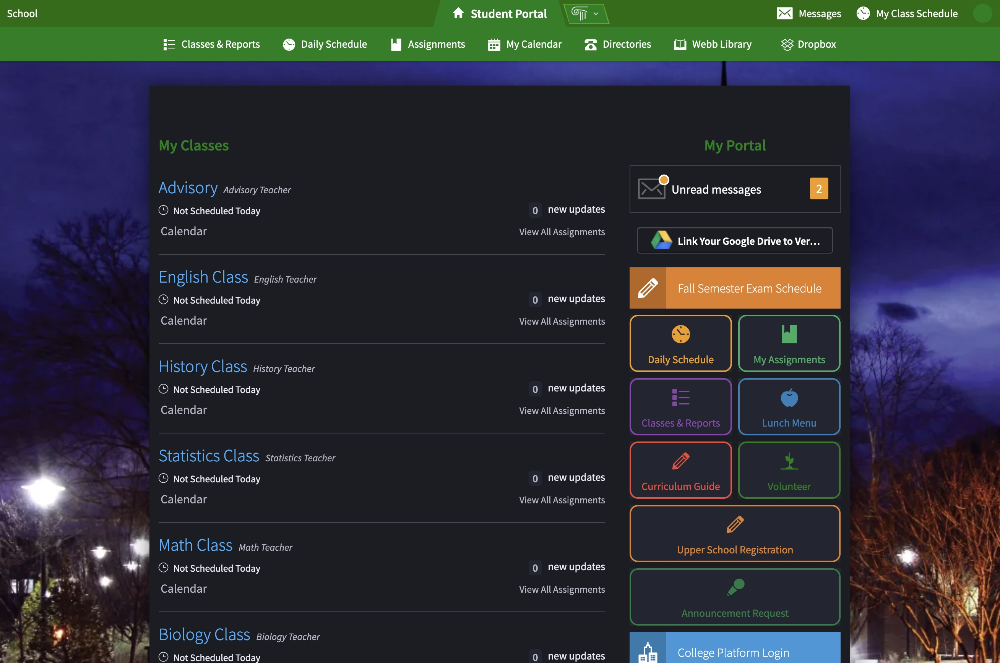

<a href='https://chrome.google.com/webstore/detail/verallel/gndjmpiohedkdigkpibefbaoboajlnah'>Get it on the chrome webstore</a> 
Check out <a href="https://github.com/Webb-School-Computer-Science-Club/Verallel">Verallel's Chrome Version</a> and <a href = 'https://2023popn.github.io/VeraNav/'>VeraNav</a>, a website made for easier navigation of Veracross!

# Verallel
A student-made, student-tailored web extension for Veracross. Provides dark mode, ease of navigation, getting assignments, and other quality of life features.

 

Unfortunately, this extension is currently only compatible for Webb students, as the links will not work if your Veracross is a different school. 

 

 
  
  

 

# Jump to
[Installation](#installation)

[Issue Handling](#issue-handling)

[Helping with Development](#helping-with-development)

[Potential Feature Additions](#potential-feature-addons-the-dev-team-has-high-on-the-bucket-list)

# Installation
First, we need to download the [latest version](https://github.com/Webb-School-Computer-Science-Club/Verallel/releases/) of the extension. Scroll down the page of the latest versions list until you see a file link that says "VerallelFFV(some version here).zip" (the FF part is important). Download the file to your Downloads folder and extract it.

Now, in Firefox, visit [about:debugging#/runtime/this-firefox](about:debugging#/runtime/this-firefox) (make sure the firefox icon is clicked on the left menu bar). In the middle of the page should be a button that says "load temporary add-on." Click this, then navigate in your file explorer for the extracted extension folder. Inside the folder should be a file that's called "manifest.json." Click the file and open up the extension.

Great! Now we're finished. Please note that we do have to do this process every time the browser restarts. If you're tired of this, download [Firefox Developer Edition](https://www.mozilla.org/en-US/firefox/developer/) or [Firefox Nightly](https://www.mozilla.org/en-US/firefox/nightly). In [about:config](about:config) set `xpinstall.signatures.required` to **false** and drag and drop the extension folder into about:addons, and it should stay persistent across restarts.

# Issue Handling
When it comes to repository issues, please keep in mind that the developer team for Verallel has an order of priorities for issue fixing. There isn't a rigid order, but expect issues about major bugs to be solved first over adding minor feature enhancements. This shouldn't deter you from making an issue for a bug or a feature request if you have one, but acknowledge that there a limited amount of people on the team, each with other commitments of their own.   If you make an issue about a bug, please detail how you got to the bug and if that bug is consistently reproducible. Additionally, make sure your issue is not already an issue on the repository. 

## Current Issue Temp Fixes
- you must sign in to veracross on *default* firefox container to activate the assignment getting function.

# Helping with Development
If you wish to help with the development of the site, the zip folder release of the extension will be provided (and maybe some other beta versions the dev team is working on). If you are not part of the dev team and end up making yor own working version please publish the code as a fork of this repository. Additionally, make sure to detail the changes you make in your fork compared to the original. 
This is the repository for the Chrome extension for Verallel. If you want to help with Verallel as a Firefox add-on, you should check out <a href="https://github.com/Webb-School-Computer-Science-Club/Verallel-Firefox">Verallel-Firefox</a> 
If you want to download the newest version of the repository to test things, you can always git clone it and then test it out on Chrome by turning on Developer mode in chrome://extensions and then loading the unzipped folder into your browser. 

[Back to Top](#verallel)

# Potential Feature Additions the Dev Team has High on the Bucket List
  - Making the links compatible for other schools the most conveniently
  - Miscellaneous quality of life improvements
